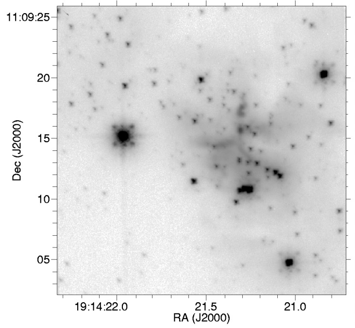

Common image aberrations
==========================
Images taken using ShARCS and PHARO are liable to a variety of image aberrations, both ones common to detectors in general and a few unique to these instruments.

PHARO
------
Because of instrinsic phase error, the algorithm used to control the Palomar AO deformable mirror produces a characteristic four-point pattern around some 
sources in PHARO images. This aliasing effect is known as "waffle mode" (see the below image from `Hayward et al. 2001 <https://ui.adsabs.harvard.edu/abs/2001PASP..113..105H/abstract>`_). Especially if multiple authentic sources are in the field of view, 
waffle mode errors can be clearly identified, because the spots occur at the same offsets relative to their respective sources.

