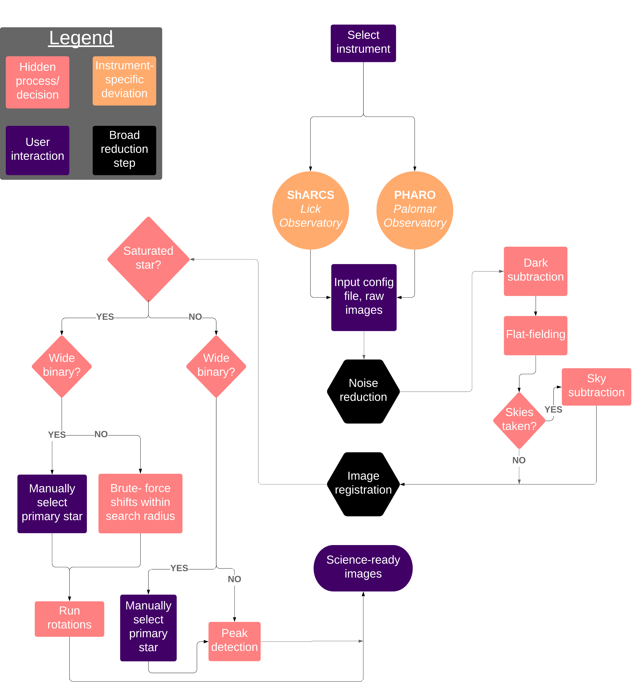

Overview
============

Tutorials
-----------
There are two Jupyter notebook tutorials included with the installation (src/simmer/Examples), one for each instrument currently supported by the code. Each covers the portions of the code necessary to perform a reduction.

Overview
---------------------
Our code performs standard dark-subtraction and flat-fielding operations on the data. In the image-stacking ("registration") mode, however, there are a few options regarding how to proceed. The default (quickest) mechanism is essentially a peak-finding algorithm, which makes some local maximum the center of each science frame. For other stars (saturated ones, for example), this scheme is insufficient. As such, we perform a more complex registration scheme in which we subtract rotated frames from their originals, minimizing residuals with respect to the center of said rotations. Finally, for stars that are widely separated and are of somewhat equal brightness, we have a "wide binary" mode, in which the user selects which star is the primary around which each image should be centered.

The config file
---------------------
The desired registration methods for each object (in addition to exposure time, filter, comments, and associated raw data file numbers) are stored and accessed in a **config file**, an example of which is provided in the installation. If image registration is not specified in the config file, the code progresses with the default method. If, however, the default method does not converge, the code resorts to the saturated star method.

.. image:: ../img/config.jpg
  :width: 700
  :alt: Alternative text
