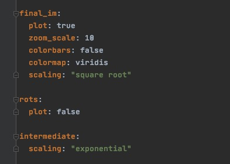

Plotting
============
Throughout the data reduction process, :code:`SImMER` produces a number of
intermediate images with the `Matplotlib <https://matplotlib.org/>`_ module:
dark cubes, flat cubes, sky cubes, and rotations.
Additionally (as expected from a reduction pipeline!), a final image, resulting
from all the noise-reduction and registration steps, is produced.

By default, all of these images are saved in the user-specified :code:`red_dir`
directory, with the :code:`simmer.plotting` module containing all relevant code.
For more fine-grained control of the stock developer-specified
settings, a user can input their own set of plotting settings. This is done with
the `YAML <https://yaml.org/>`_ markup language. This markup language was chosen
(in lieu of raw JSON, for example) given its readable, Python-reminiscent
indentation. Users can supply a path to a .yml file specifying their plotting
preferences to any driver; once this is done, their .yml file is validated with
the `Cerberus <https://docs.python-cerberus.org/en/stable/index.html>`_ package
against the *schema*, or archetypal YAML file. If the validation succeeds,
the plotting preferences are propagated through the rest of the program.

Above, we see an example .yml file for plotting configuration supplies by the
user. Each type of plot (referred to as :code:`plot_type` in :code:`SImMER` code) has its
own dictionary of plotting arguments.
